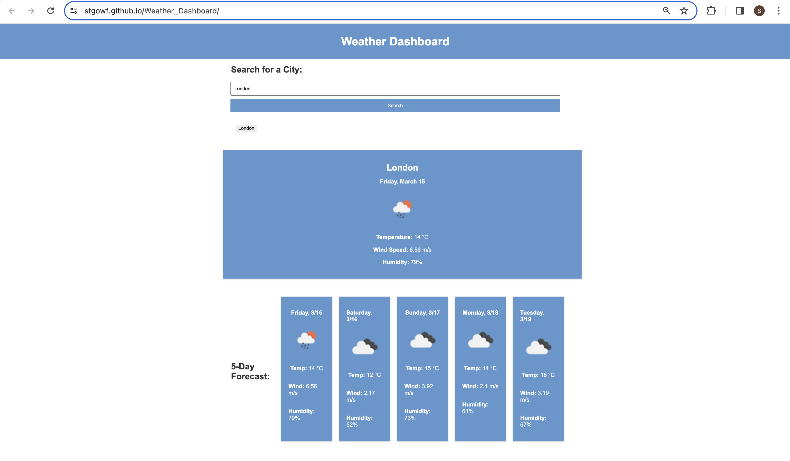

# Weather App

## Overview
This application provides real-time weather information for cities around the world, allowing users to check current weather conditions and a 5-day forecast. Built with JavaScript and utilizes the OpenWeatherMap API for weather data retrieval. Responsive design ensures seamless user experience across various devices.

## Features
- **City Search**: Users can search for weather information by entering the name of a city.
- **Current Weather Display**: Displays current weather conditions including temperature, wind speed, and humidity.
- **5-Day Forecast**: Provides a forecast for the next 5 days, showing temperature, wind speed, and humidity.
- **Search History**: Keeps track of previously searched cities for quick access.

## Screenshot

## Live Demo
Explore the Weather App [here](https://stgowf.github.io/Weather_Dashboard/).

## Usage
1. Visit the live Weather App using the provided link.
2. Enter the name of a city in the search bar and press 'Enter'.
3. View the current weather details and 5-day forecast for the selected city.
4. To check weather for another city, simply enter its name in the search bar.

## Technologies Used
- JavaScript
- OpenWeatherMap API

## Getting Started
To run the Weather App locally, follow these steps:
1. Clone this repository to your local machine.
2. Open the index.html file in your web browser.

## Contributing
Contributions are welcomed! If you have any suggestions, bug fixes, or new features to propose, please fork the repository, make your changes, and submit a pull request. Your contributions help improve the Weather App for everyone. Thank you for your support!

Thank you for using the Weather App!
